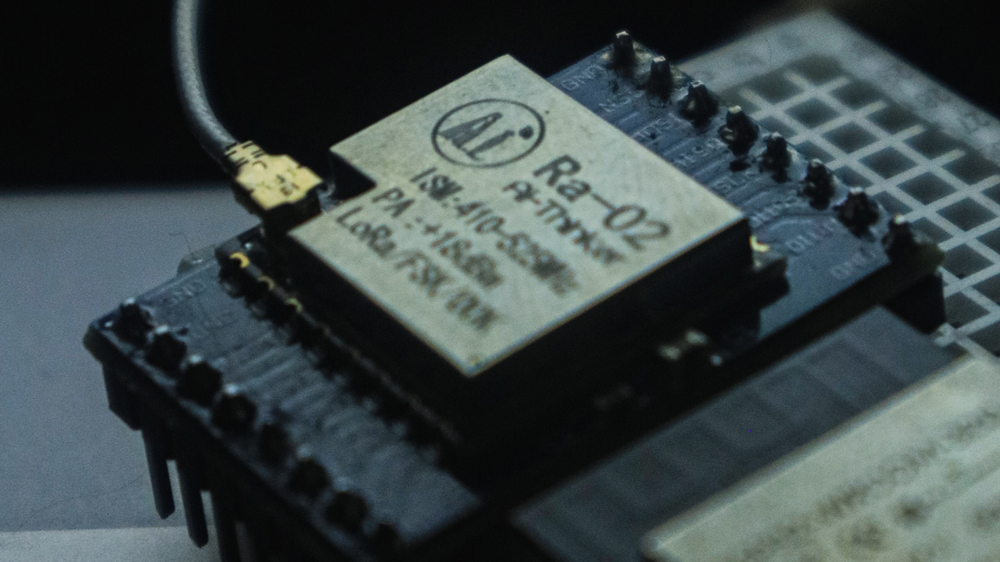
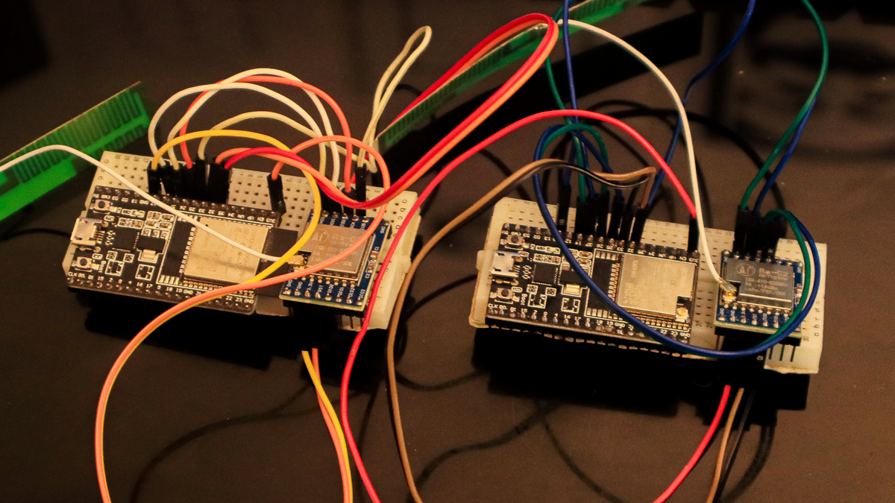
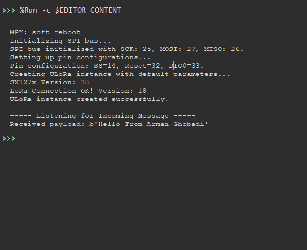

# ULoRa: Lightweight LoRa Library for SX127x Modules


`ULoRa` is a lightweight MicroPython library designed for interfacing with SX127x series LoRa modules (e.g., SX1276, SX1278). This library allows for long-range communication with low power consumption, making it ideal for IoT (Internet of Things) applications. It supports a wide range of features such as packet transmission, reception, power management, and more, all customizable for your specific needs.



## Features
- **Packet Transmission and Reception** using LoRa
- Configurable parameters: frequency, spreading factor, TX power, bandwidth, coding rate, preamble length
- **Low Power Management**: Sleep and standby modes
- Automatic hardware reset handling
- Support for CRC and IQ inversion
- Implicit header mode support
- Full MicroPython integration for embedded systems

## Supported Platforms
- ESP32 
- ESP8266
- Any MicroPython-supported platform with SPI interface support

## Hardware Requirements
- SX127x LoRa module (e.g., SX1276, SX1278)
- Microcontroller with SPI support (e.g., ESP32)
- Jumper wires to connect the LoRa module to the microcontroller


## Installation

### Install via PyPI (Recommended)
To install `ULoRa` via upip, run the following command:

```bash
upip install ulora
```

### Manual Installation
Alternatively, you can download the `ulora` files from the repository and place it in your project folder .


## Hardware Connections

### Pinout for ESP32 (or other compatible platforms)
```plaintext
SX1278 Module   | ESP32 Pins
----------------|--------------
  DIO0          | 33
  SS (Chip Select) | 14
  Reset         | 32
  SCK           | 25
  MISO          | 26
  MOSI          | 27
```

Make sure to connect the LoRa module correctly to the microcontroller for communication.




## Library Usage

### Importing the Library

To use the `ULoRa` library in your project, start by importing it:

```python
from ulora.core import ULoRa
from machine import SPI, Pin
```

### Initializing the LoRa Module

Create an `SPI` object and define the pins to connect the LoRa module to your microcontroller:

```python
spi = SPI(1, baudrate=5000000, polarity=0, phase=0,sck=Pin(25), mosi=Pin(27), miso=Pin(26))
pins = {"ss": 14, "reset": 32, "dio0": 33}

lora = ULoRa(spi, pins)
```

You can also configure optional parameters like frequency, spreading factor, etc., during initialization:

```python
parameters = {
    "frequency": 433000000,
    "tx_power_level": 10,
    "spreading_factor": 8,
}

lora = ULoRa(spi, pins, parameters)
```

### Sending Data

To send a message, use the `println()` method. The `repeat` parameter specifies how many times to repeat the transmission:

```python
lora.println("Hello, LoRa!", repeat=3)
```

To send binary data, use the `send()` method:

```python
lora.send(b"Hello, LoRa!")
```

### Receiving Data

To receive data, use the `listen()` method. You can set the `timeout` parameter to control how long the receiver waits for a message:

```python
message = lora.listen(timeout=5000)
if message:
    print("Received:", message)
else:
    print("Timeout - No data received")
```

To check for available data in a non-blocking way, use the `check()` method:

```python
if lora.check():
    print("Data is available!")
    message = lora.listen(timeout=1000)
    print("Received:", message)
```


### Example Sender Device 


```python
from machine import Pin, SPI
from time import sleep
from ulora.core import ULoRa  # Ensure the ULoRa class is implemented and imported correctly

# ============================================================================ 
# Sender Test Example
# ============================================================================ 
if __name__ == "__main__": 
    # This example is designed for a MicroPython environment with an SX127x connected. 
    # Adjust the SPI bus and pin numbers as per your hardware configuration.
    try: 
        # ------------------------- Initializing SPI -------------------------
        print("Initializing SPI bus...")
        spi = SPI(1, baudrate=5000000, polarity=0, phase=0,
                  sck=Pin(25), mosi=Pin(27), miso=Pin(26))
        print("SPI bus initialized with SCK: 25, MOSI: 27, MISO: 26.")
        
        # ------------------------- Defining Pin Mappings --------------------
        print("Setting up pin configurations...")
        pins = {
            "ss": 14,     # Chip Select (CS) pin
            "reset": 32,  # Reset pin
            "dio0": 33    # DIO0 pin
        }
        print(f"Pin configuration: SS={pins['ss']}, Reset={pins['reset']}, DIO0={pins['dio0']}.")
        
        # ------------------------- Creating ULoRa Instance ------------------
        print("Creating ULoRa instance with default parameters...")
        lora = ULoRa(spi, pins)
        print("ULoRa instance created successfully.")
        
        # ------------------------- Transmitting Test Message ----------------
        test_message = "Hello From Arman Ghobadi"
        print("\n----- Transmitting Message -----")
        print(f"Message: {test_message}")
        
        # Send the message via LoRa
        lora.println(test_message)
        
        print("Message transmission complete.")
        print("---------------------------------------------------------------------\n")
        
        # ------------------------- Waiting for Response ---------------------
        # You can add code here to listen for incoming messages if needed.
        print("You can now listen for responses...")

    except Exception as e:
        # ------------------------- Error Handling --------------------------
        print("\nError during test:")
        print(f"Exception: {e}")
        print("Please check the wiring and LoRa module configuration.")


```

## Test Sender Image


### Example Receiver Device 


```python
from machine import Pin, SPI
from time import sleep
from ulora.core import ULoRa  # Ensure the ULoRa class is implemented and imported correctly

# ============================================================================ 
# Sender Test Example
# ============================================================================ 
if __name__ == "__main__": 
    # This example is designed for a MicroPython environment with an SX127x connected. 
    # Adjust the SPI bus and pin numbers as per your hardware configuration.
    try: 
        # ------------------------- Initializing SPI -------------------------
        print("Initializing SPI bus...")
        spi = SPI(1, baudrate=5000000, polarity=0, phase=0,
                  sck=Pin(25), mosi=Pin(27), miso=Pin(26))
        print("SPI bus initialized with SCK: 25, MOSI: 27, MISO: 26.")
        
        # ------------------------- Defining Pin Mappings --------------------
        print("Setting up pin configurations...")
        pins = {
            "ss": 14,     # Chip Select (CS) pin
            "reset": 32,  # Reset pin
            "dio0": 33    # DIO0 pin
        }
        print(f"Pin configuration: SS={pins['ss']}, Reset={pins['reset']}, DIO0={pins['dio0']}.")
        
        # ------------------------- Creating ULoRa Instance ------------------
        print("Creating ULoRa instance with default parameters...")
        lora = ULoRa(spi, pins)
        print("ULoRa instance created successfully.")
        
        # ------------------------- Transmitting Test Message ----------------
        test_message = "Hello From Arman Ghobadi"
        print("\n----- Transmitting Message -----")
        print(f"Message: {test_message}")
        
        # Send the message via LoRa
        lora.println(test_message)
        
        print("Message transmission complete.")
        print("---------------------------------------------------------------------\n")
        
        # ------------------------- Waiting for Response ---------------------
        # You can add code here to listen for incoming messages if needed.
        print("You can now listen for responses...")

    except Exception as e:
        # ------------------------- Error Handling --------------------------
        print("\nError during test:")
        print(f"Exception: {e}")
        print("Please check the wiring and LoRa module configuration.")


```

## Test Receiver Image



## License

`ULoRa` is licensed under the MIT License. See the [LICENSE](LICENSE) file for more details.

## Acknowledgements
- Thanks to the MicroPython community for providing great resources and libraries.
- LoRa module specifications are based on [Semtech SX127x datasheets](https://www.semtech.com/products/wireless-rf/lora-transceivers/sx1276).
